```{r setup, include=FALSE}
knitr::opts_chunk$set(echo = FALSE)
```

## Growing Demand for Statistics

## Growing Demand for Statistics

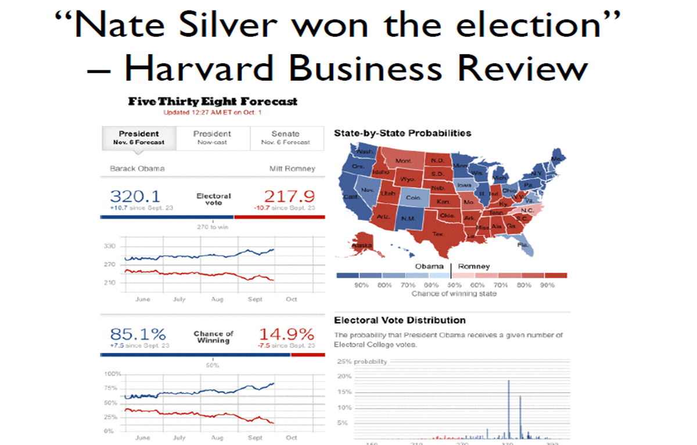{width=60%}

## Growing Demand for Statistics

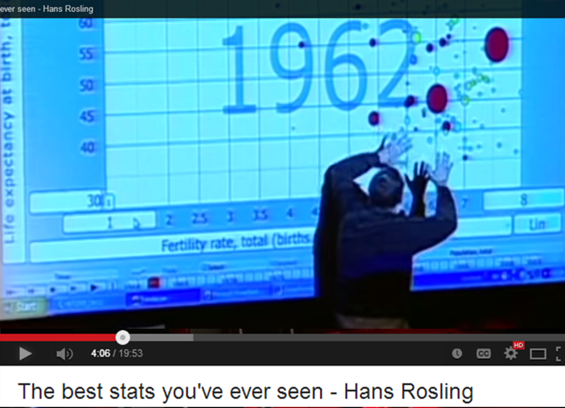{width=60%}

## Growing Demand for Statistics
McKinsey & Company (Manyika et al., 2011) has predicted shortfalls of 150,000 data analysts and 1.5 million managers who are knowledgeable about data and their relevance.


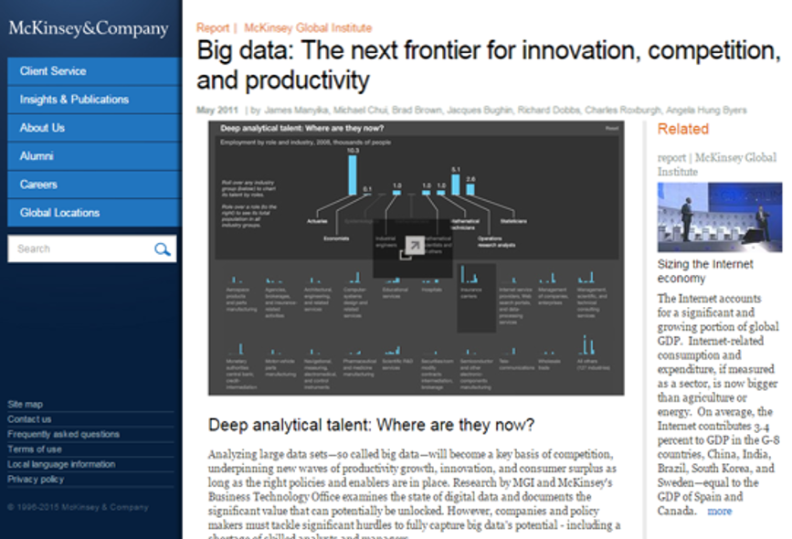{width=60%}

## Growing Demand for Statistics

{width=30%}


## Challenges to the Growing Demand for Statistics


## Challenges to the Growing Demand for Statistics

{width=40%}

## Challenges to the Growing Demand for Statistics

{width=40%}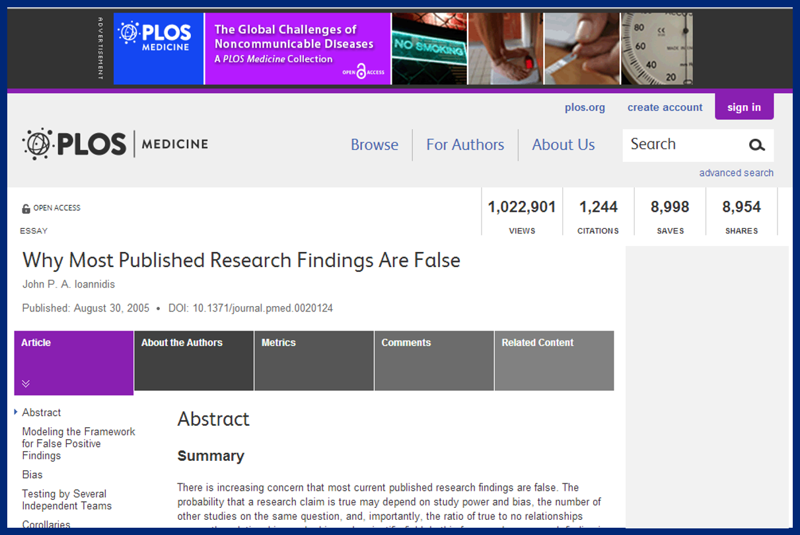{width=40%}

## Challenges to the Growing Demand for Statistics

{width=40%}{width=40%}

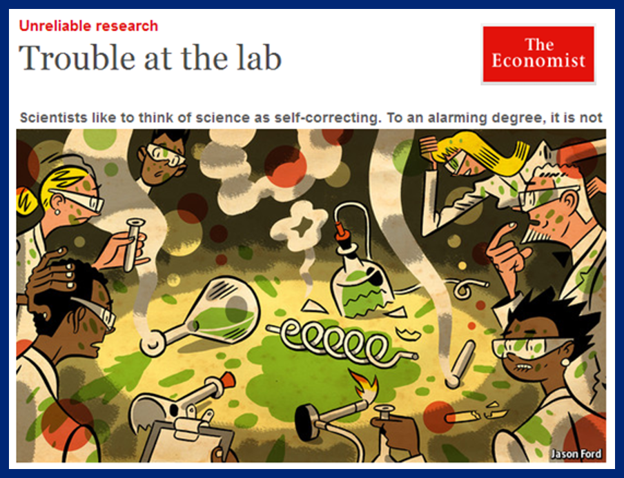{width=40%}

## Reproducibility

Reproducibility is the ability for a study or experiment to be duplicated. 

## Reproducibility: Science Isn't Broken (fivethirtyeight.com)

"Nosek's team invited researchers to take part in a crowdsourcing data analysis project. The setup was simple. Participants were all given the same data set and prompt: **Do soccer referees give more red cards to dark-skinned players than light-skinned ones?** They were then asked to submit their analytical approach for feedback from other teams before diving into the analysis.

Twenty-nine teams with a total of 61 analysts took part. The researchers used a wide variety of methods, ranging - for those of you interested in the methodological gore - from simple linear regression techniques to complex multilevel regressions and Bayesian approaches. They also made different decisions about which secondary variables to use in their analyses."


## Reproducibility: Science Isn't Broken (fivethirtyeight.com)

"Nosek's team invited researchers to take part in a crowdsourcing data analysis project. The setup was simple. Participants were all given the same data set and prompt: **Do soccer referees give more red cards to dark-skinned players than light-skinned ones?** They were then asked to submit their analytical approach for feedback from other teams before diving into the analysis.

Twenty-nine teams with a total of 61 analysts took part. The researchers used a wide variety of methods, ranging - for those of you interested in the methodological gore - from simple linear regression techniques to complex multilevel regressions and Bayesian approaches. They also made different decisions about which secondary variables to use in their analyses."


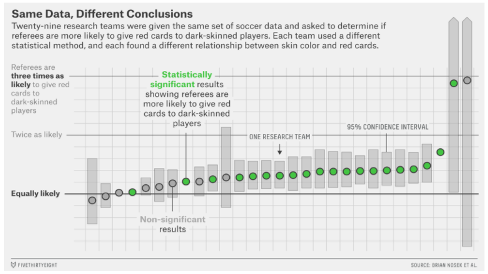{width=60%}

## p-Hacking

<iframe width="560" height="315" src="https://www.youtube.com/embed/FLNeWgs2n_Q" frameborder="0" allow="accelerometer; autoplay; encrypted-media; gyroscope; picture-in-picture" allowfullscreen></iframe>

https://www.youtube.com/watch?v=FLNeWgs2n_Q

## p-Hacking, Multiple Comparisons and Data Dredging

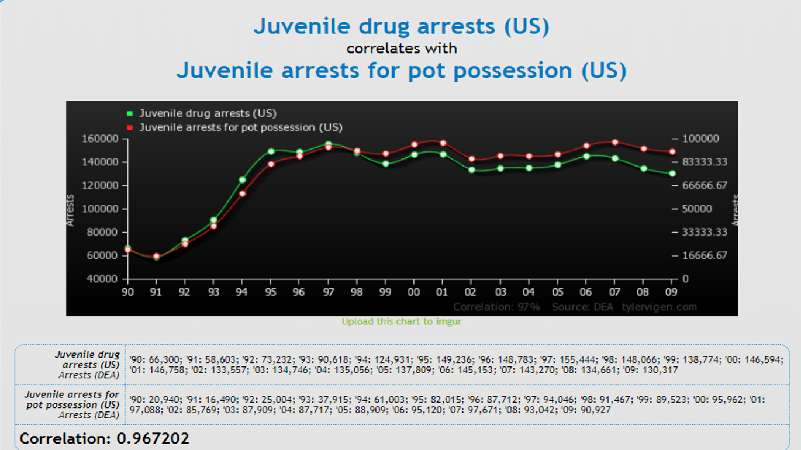{width=60%}

## p-Hacking, Multiple Comparisons and Data Dredging

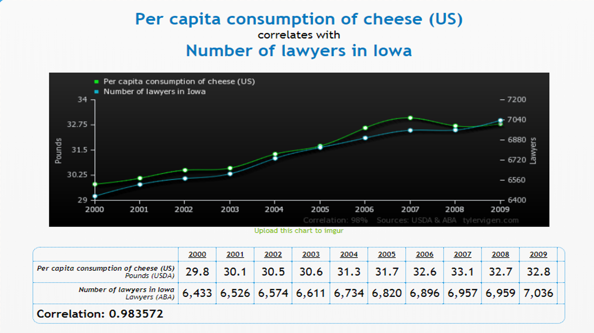{width=60%}

## p-Hacking, Multiple Comparisons and Data Dredging

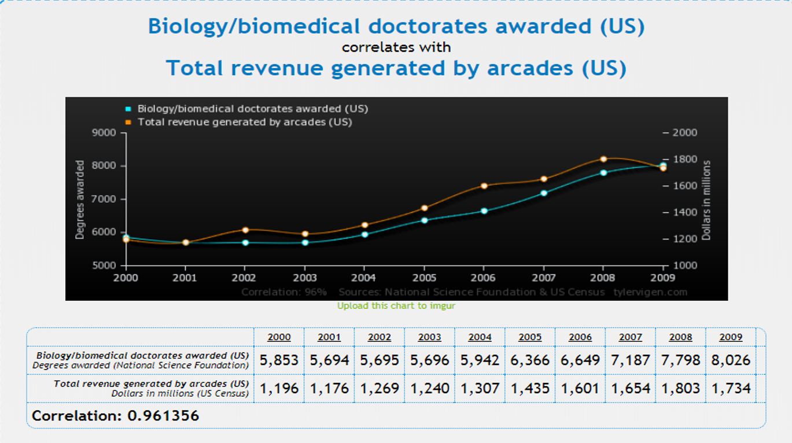{width=60%}

## p-Hacking, Multiple Comparisons and Data Dredging

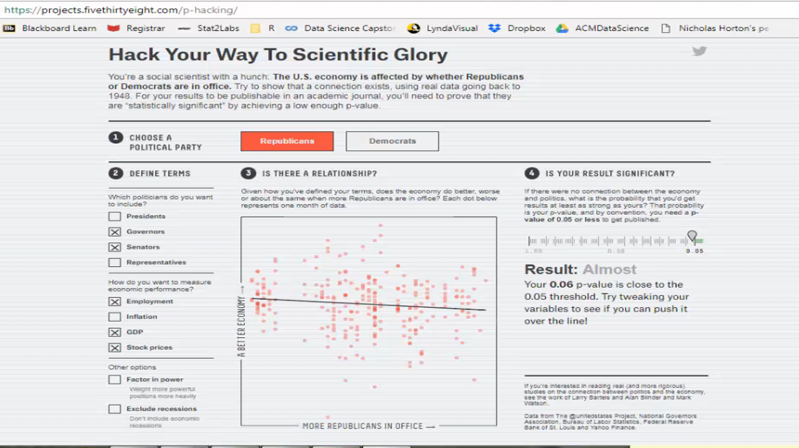{width=60%}

## p-Hacking, Multiple Comparisons and Data Dredging

Does having democrats in power improve our economy?


## p-Hacking, Multiple Comparisons and Data Dredging

Does having democrats in power improve our economy?

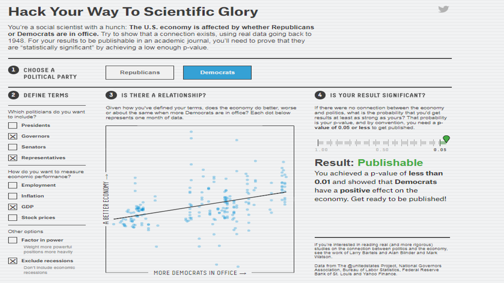{width=60%}


## p-Hacking, Multiple Comparisons and Data Dredging

Does having democrats in power improve our economy?

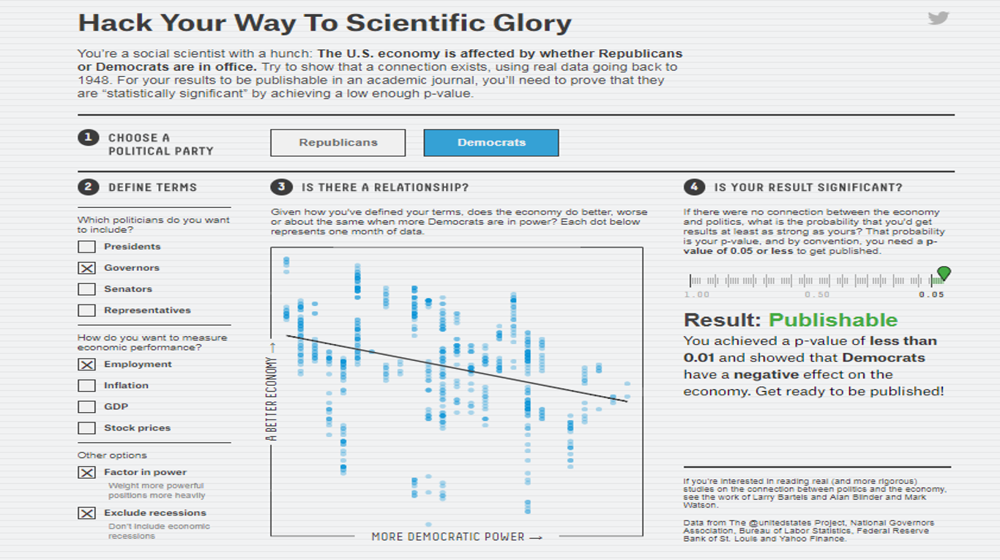{width=60%}


## p-Hacking, Multiple Comparisons and Data Dredging


## p-Hacking, Multiple Comparisons and Data Dredging

How can you use p-values in multiple regression to prove or disprove the relationship between:

- smoking cigarettes and lung cancer
- vaccines and autism
- the pesticide DDT and birth defects
- anthropogenicly-generated greenhouse gasses and climate change


## p-Hacking, Multiple Comparisons and Data Dredging

How can you use p-values in multiple regression to prove or disprove the relationship between:

- smoking cigarettes and lung cancer
- vaccines and autism
- the pesticide DDT and birth defects
- anthropogenicly-generated greenhouse gasses and climate change


With large datasets, we can almost always find "significant results" to support our conclusions.

## p-Hacking, Multiple Comparisons and Data Dredging

How can you use p-values in multiple regression to prove or disprove the relationship between:

- smoking cigarettes and lung cancer
- vaccines and autism
- the pesticide DDT and birth defects
- anthropogenicly-generated greenhouse gasses and climate change

With large datasets, we can almost always find "significant results" to support our conclusions.

He uses statistics as a drunken man uses lamp posts - for support rather than for illumination. 
				-Andrew Lang 
				
When a measure becomes a target, it is no longer a measure.
        - Goodhart's law

##  p-Hacking, Multiple Comparisons and Data Dredging

Analysis of more than 4,000 studies of neurological diseases suggest that the published work - some of which was used to justify human clinical trials - is biased towards reporting positive results.


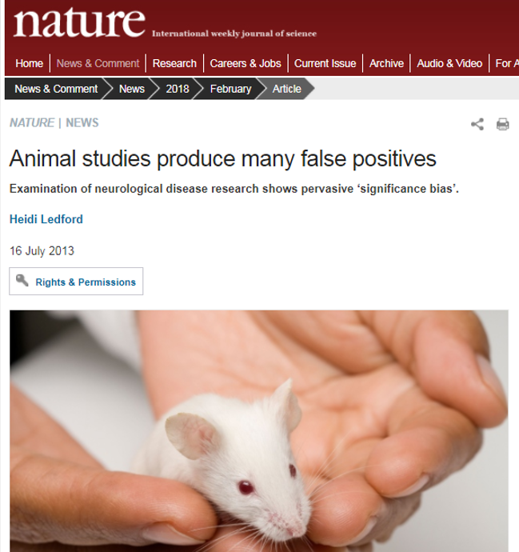{width = 50%}

## p-Hacking, Multiple Comparisons and Data Dredging

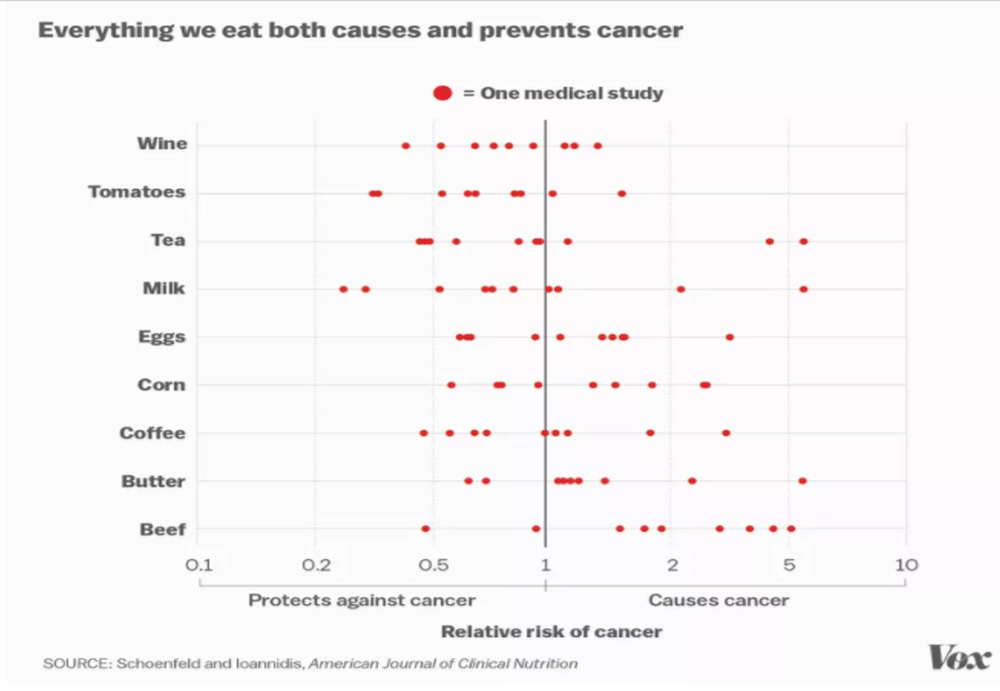{width=60%}

## p-Hacking, Multiple Comparisons and Data Dredging

"We know that as much as 30 percent of the most influential original medical research papers later turn out to be wrong or exaggerated." 

{width=60%}

## Introduction to R Markdown

[Introdution to R Markdown](http://prezi.com/dvmgx17e_was/reproducible/?utm_campaign=share&utm_medium=copy) by Andrew Bray


http://prezi.com/dvmgx17e_was/reproducible/?utm_campaign=share&utm_medium=copy

## Resources

* For more details on using R Markdown see <http://rmarkdown.rstudio.com>.

* A Prezi introducing the features of R Markdown and its use in lab reports can be found at:
http://prezi.com/dvmgx17e_was/reproducible/?utm_campaign=share&utm_medium=copy. 

* Baumer et al. (2014), R Markdown: Integrating A Reproducible Analysis Tool into Introductory Statistics, Technology Innovations in Statistics Education, http://escholarship.org/uc/item/90b2f5xh. 

* https://www.nytimes.com/2017/10/18/magazine/when-the-revolution-came-for-amy-cuddy.html

* http://www.cbsnews.com/news/deception-at-duke-fraud-in-cancer-care/, retrieved 2/12/2018


## References

- Slide 3: Joe Blitzstein (Harvard Statistics Department) blitz@fas.harvard.edu, @stat110, https://www.scribd.com/document/178275229/Introductionto-
Data-Science
- Slide 4:  Hans Rosling image: https://www.ted.com/talks/hans_rosling_shows_the_best_stats_you_ve_ever_seen, Using visualizations to understand economic development
- Slide 5:  McKinsey Report: https://www.mckinsey.com/business-functions/digital-mckinsey/our-insights/big-data-the-next-frontier-for-innovation retrieved 4/23/15
- Slide 6: Graphic from an article appearing on March 2, 2013, on page A2 in the U.S. edition of The Wall Street Journal, with the headline: Data Crunchers Now the Cool Kids on Campus. http://online.wsj.com/article/SB10001424127887323478304578332850293360468.html?mod=WSJ_hps_RightRailColumns 
- Slide 7-9 Trouble in the Lab: https://www.economist.com/news/briefing/21588057-scientists-think-science-self-correcting-alarming-degree-it-nottrouble.
Is Psychology Undone: https://www.chronicle.com/blogs/percolator/is-psychology-about-to-come-undone/29045.
Published Research False: http://journals.plos.org/plosmedicine/article?id=10.1371/journal.pmed.0020124.
- Slide 11-13 https://fivethirtyeight.com/features/science-isnt-broken
- Slide 14: https://www.youtube.com/watch?v=FLNeWgs2n_Q
- Slide 15-17: http://www.tylervigen.com/spurious-correlations
- Slide 19-21: https://fivethirtyeight.com/features/science-isnt-broken/
- Slide 22: https://www.facebook.com/AmstatNews/photos/a.10151627754628687.1073741825.262043213686/10152653717338687/
- Slide 26: http://www.nature.com/news/animal-studies-produce-many-false-positives-1.13385
- Slide 27-28: https://www.vox.com/2015/3/23/8264355/research-study-hype. Quote from https://www.vox.com/2015/2/16/8034143/john-ioannidis-interview


