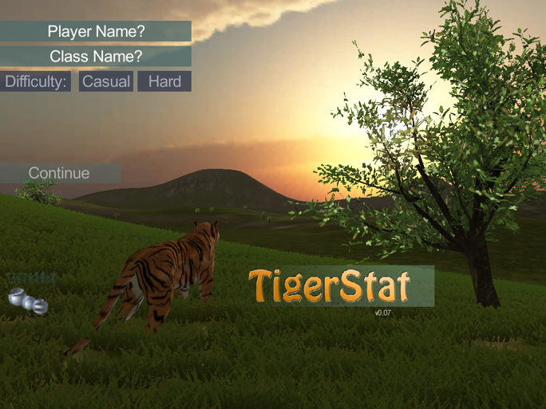
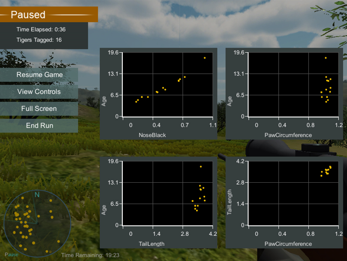

<<<<<<< HEAD
---
title: "Predicting the Age of Amur Tigers"
author: "Shonda Kuiper"
output: html_document
---

```{r setup, include=FALSE}
knitr::opts_chunk$set(
  include = TRUE,
  fig.align = "center",
  fig.height = 3, 
  fig.width = 3
  )
library(ggformula)
library(mosaic)
library(readr)
library(corrplot)
library(GGally)
```

## 1. Introduction

The Bol'shaya Koshka (Russian for big cat) Reserve is a newly created animal reserve that was uniquely developed to help endangered species prosper.  This 10,000 acre wild animal reservation was selected because an abundance of Siberian tigers have been found in the area. The diverse terrain of the reserve provides a wide variety of habitats for many different species of animals.

Since the tigers in this area are much more abundant than any other area in the world, they are starting to draw a significant number of researchers to the region.  Your primary responsibility will be to help these researchers as they study the tigers and then incorporate the results of their research into a system to identify the best management practices for this reserve. 

An important component of monitoring endangered species is to understand the age distribution of the population. At this preliminary stage, you you will examine the preliminary tiger data collected to determine if it is appropriate to use in developing a model for tiger age prediction and potentially other research questions of interest. Your `Tiger1` dataset contains several variables:

*	Age (in years) - a quantitative variable that ranges from 0 to 20
*	NoseBlack - the percent of the tiger's nose that is black
*	Weight (in pounds)
*	Sex (Female or Male)
*	Length - the length of the tiger (in inches)
*	Paw - the width of the back paw (in inches)
*	Region - one of 6 regions of the preserve (0, 1, 2, 3, 4 and 5) defined by terrain features


#### Some packages we will use

Be sure to load these packages *in your R Markdown document*.

```{r message = FALSE, echo = TRUE}
library(ggformula)  # for plots
library(mosaic)     # for numerical summaries
library(readr)      # to load data from csv
library(GGally)     # for graphical comparisions of pairs of variables
```

#### Loading the data


```{r message = FALSE}
Tiger1 <- read_csv("data/TigerData1.csv")   # Reads the data 
head(Tiger1, 5)   
```


## 2. Inspect the Data

Produce a few statistics and graphs to get a feel for each of the variables in the data set. We provide several example plots below.

```{r }
Tiger1 <- mutate(Tiger1, Region = as.factor(Region))

favstats(Age ~ Sex, data = Tiger1)
tally(Region ~ Sex, data = Tiger1)
```

```{r, fig.width = 6, fig.height = 6, message = FALSE }
TigerCont <- select(Tiger1, Age, Weight, NoseBlack, Paw, Length)
ggpairs(TigerCont)
ggpairs(Tiger1)
```


```{r}
gf_density(~ Age, data = Tiger1, color = ~ Sex, fill = ~ Sex) 

gf_point(Age ~ Weight, data = Tiger1, color = ~ Sex) %>%
gf_lm()

gf_point(Weight~Length, data = Tiger1, color = ~ Sex) %>%
  gf_density2d(Weight~Length, data = Tiger1) %>%
  gf_facet_wrap(~ Region)

gf_jitter(Age ~ Region, color = ~ Sex, data = Tiger1,
          width = 0.1, height = 0) %>%
  gf_line(Age ~ Region, color = ~ Sex, data = Tiger1,
          group = ~ Sex, stat="summary") 
```


**Your Turn**

Modify the graphs above or use the `mplot()` function to create a graph.

In the RStudio Console, type 

*  $> library(mosaic)$, 
*  $> mplot(Tiger1)$, 
*  select 2 for a two-variable plot. 
*  Select the gear symbol in the top right corner of the graphics window and experiment with various graphs. 

After you have created a graph you like, display the code and copy it into an R chunck. Modify the code to include an appropriate title to the plot.


**Create one graph for each of the following questions**

* Are the three size variables (Length, Paw, and Weight) highly correlated? 
* What appears to be the best predictor of Age?
* Is there a difference in the size of male and female tigers?
* Are there differences between tigers in different regions?
* Do you think there are issues with your sample of tigers?  For example, are there tigers in the preserve that may not be adequately represented in the sample?  From the references listed below, we know, for example, that the age range for Amur tigers is typically 0-20 years old


#### Addressing Issues of Potential Bias

Based on the results and observations made in Section 2, you likely noticed that different populations of tigers tend to live in different reasons. For example, it appears that some regions have a much larger percentage of female tigers than others. 

* 	Is this sample representative of the tiger population more generally? If not, why?  If so, give support for this answer. 
* 	Would your sample be appropriate for answering questions like estimating the average size or age of tigers in the preserve?
* 	If another sample were taken, what recommendations would you make for collecting the data?  Are there dangers with simply "randomly" walking around and collecting data on the closest tigers?


A final note about random sampling and bias:  all is not lost if a sample has issues such as regional differences, or data that differs on some other characteristic between comparison groups.  Sometimes, more complicated models can account for or "adjust" for these disparities.  A multivariable model, for example, might suffice.  Of course, a better option is to carefully plan the sampling to ensure bias is not present.  A simple random sample is not always "best" and other sampling schemes are possible.  Review additional statistical studies or consult a statistician prior to collecting or analyzing data that could have these issues. 

## 3. Creating a Model to Predict Age

### Model 1: Simple Linear Regression
The code below creates a simple linear regression model to predict `Age` based upon `Weight`.

```{r}
Tiger.lm = lm(Age ~ Weight, data = Tiger1)  # Creating a simple linear model
Tiger.lm

summary(Tiger.lm)        # Summary of results
anova(Tiger.lm)          # ANOVA table is also useful

resid1 <- Tiger.lm$res   # Create a vector of residuals from the Tiger.lm model

#It is often helpful to attach the residuals and fitted values to the data frame.
TigerModel = mutate(Tiger1, resid1, fits1 = Tiger.lm$fitted.values)
head(TigerModel)          # show the first rows of the TigerModel data frame

# Create a scatterplot with fitted line
gf_point(Age ~ Weight, data = TigerModel)%>%
  gf_line(fits1~Weight)

# Create a residual plot
gf_point(resid1 ~ Weight, data = TigerModel)%>%
  gf_hline(yintercept = 0)
```

** Questions**

* Is the model a good fit?
* What does the p-value tell us about the relationship between Weight and Age?
* What does the $R^2$ Value tell us about the relationship between Weight and Age?


### Model 2: Interactions

Based upon an earlier scatterplot, we may want to ask whether there is an important interaction term between Sex and Weight variables when predicting age? 

```{r}
Tiger2.lm = lm(Age ~ Weight * Sex, data = Tiger1)
summary(Tiger2.lm)
anova(Tiger2.lm)

TigerModel <- mutate(TigerModel, resid2 = Tiger2.lm$residuals, fits2 = Tiger2.lm$fitted.values)

gf_point(Age ~ Weight, data = TigerModel, color = ~ Sex)%>%
  gf_line(fits2~Weight)
```

** Questions**

* Create a third model with corresponding graphs, `Tiger3.lm = lm(Age ~ Weight + Sex, data = Tiger1)`. What is the difference between `Weight*Sex` and `Weight + Sex`? 
* Which of the three models would you suggest? Why?
* Notice in all three models, the variance of the residuals increase as the Weight increases. This suggests using a **Variance Stabalizing Transformation**, such as the `sqrt(Age)` or the `log(Age)`. In your three models above, replace `Age` with `log(Age)`.
* Look at the residual plots. Was the data transformation useful?  
* Based upon the six models you created, which would you suggest using? Explain your answer.
* Notice that the p-value for Sex tends to change when different models are used? After creating and evaluating all six models, is the variable `Sex` important in predicting Age? Explain your answer.
* Based upon our initial graphs in Section 2, suggest a new regression model that you believe may better predict Age.


## 4. Reproducibility

A second, larger dataset has been collected, `Tigerdata2.csv`. Conduct an anlysis similar to that done in Section 2 and Section 3. 


## 5. Collect Your Own Data

{width=30%}{width=30%}

To collect your own data, go to <http://statgames.tietronix.com/TigerSampling/>  and enter a PlayerName and GroupName (The "PlayerName" is not your personal name, just any combination of letters and numbers with no spaces). Use the GroupName JMM2019.  Select `Load Mission 1` and then `DataSet1`. You should play the tutorial briefly to get a feel for the controls. Use the Full Screen option to see the entire game on your computer screen. If you forget commands anytime during game play, you can hit the "p" key to pause the game and see game instructions. This will allow you to review all the controls, exit the game and save your data.

**Instructor resources** for this game are available at: <http://web.grinnell.edu/individuals/kuipers/stat2labs/tigersampling.html>.

**Questions to consider related to collecting data** 

1. What are some important characteristics of the tiger sample you collect to build a model for age?  What are some problems that could impact the quality of data collected on tigers?
2. In collecting data on real tigers, what issues would you want to consider?  How difficult do you
think getting a large sample? How difficult is it to get a true simple random sample?   
3. In practice, the age of all tigers in the preserve would not be known initially.  How could this be overcome?
4. What strategies will you use to collect your sample in the game?   

## 6. Background Reading and Class Discussion

Before conducting this analysis students can read an optional paper discussing current methods of estimating age in lions largely through the use of proxy variables: [Sustainable trophy hunting of African lions](https://cbs.umn.edu/sites/cbs.umn.edu/files/public/downloads/Sustainable_trophy_hunting_of_African_lions.pdf) (2004 Nature article by Whitman et al.). If this link does not work, go to the lion research page <https://cbs.umn.edu/sites/cbs.umn.edu/files/public/downloads/Sustainable_trophy_hunting_of_African_lions.pdf> and find links to articles at the botton of the page.

In this article, the subscript in Table 1 states, "Predicted values are based upon the least-squares regression of a truncated data set for 63 known-aged females in the Serengeti and Ngorongoro aged $\leq$ 10 yr (Age  = 2.0667 + 5.9037arcsin(NoseBlack); $r^2 = 0.75$, $p \leq 0.0001$)." 

**Questions to consider related to the above articles**  

1. Why is estimating the age of a lion a worthwhile question?  Is this also true for
tigers?
2. What are some of the difficulties associated with estimating the age?  How can
you address them in collecting data on tigers?
3. In the section of the article about the age estimation, what support do the
authors provide for the validity of their model?  What are some issues with their
data/model?
4. What are a few approaches to estimation for lion ages?  Which of these are
possibly useful in estimating the age of a Tiger?  What proxy variable(s) did the
author's use in their model?
5. How could you test to see if your model produces good estimates for a lion's
(Tiger's) age?
6. How precisely would you expect to predict ages of lion's based on the model in
the article?  How could you improve the precision of the model?  


=======
---
title: "Predicting the Age of Amur Tigers"
author: "Shonda Kuiper"
output: html_document
---

```{r setup, include=FALSE}
knitr::opts_chunk$set(
  include = TRUE,
  fig.align = "center",
  fig.height = 3, 
  fig.width = 3
  )
library(ggformula)
library(mosaic)
library(readr)
library(corrplot)
library(GGally)
```

## 1. Introduction

The Bol'shaya Koshka (Russian for big cat) Reserve is a newly created animal reserve that was uniquely developed to help endangered species prosper.  This 10,000 acre wild animal reservation was selected because an abundance of Siberian tigers have been found in the area. The diverse terrain of the reserve provides a wide variety of habitats for many different species of animals.

Since the tigers in this area are much more abundant than any other area in the world, they are starting to draw a significant number of researchers to the region.  Your primary responsibility will be to help these researchers as they study the tigers and then incorporate the results of their research into a system to identify the best management practices for this reserve. 

An important component of monitoring endangered species is to understand the age distribution of the population. At this preliminary stage, you you will examine the preliminary tiger data collected to determine if it is appropriate to use in developing a model for tiger age prediction and potentially other research questions of interest. Your `Tiger1` dataset contains several variables:

*	Age (in years) - a quantitative variable that ranges from 0 to 20
*	NoseBlack - the percent of the tiger's nose that is black
*	Weight (in pounds)
*	Sex (Female or Male)
*	Length - the length of the tiger (in inches)
*	Paw - the width of the back paw (in inches)
*	Region - one of 6 regions of the preserve (0, 1, 2, 3, 4 and 5) defined by terrain features


#### Some packages we will use

Be sure to load these packages *in your R Markdown document*.

```{r message = FALSE, echo = TRUE}
library(ggformula)  # for plots
library(mosaic)     # for numerical summaries
library(readr)      # to load data from csv
library(GGally)     # for graphical comparisions of pairs of variables
```

#### Loading the data

```{r message = FALSE}
Tiger1 <- read_csv("data/TigerData1.csv")   # Reads the data 
head(Tiger1, 5)   
```


## 2. Inspect the Data

Produce a few statistics and graphs to get a feel for each of the variables in the data set. We provide several example plots below.

```{r }
Tiger1 <- mutate(Tiger1, Region = as.factor(Region))

favstats(Age ~ Sex, data = Tiger1)
tally(Region ~ Sex, data = Tiger1)
```

```{r, fig.width = 6, fig.height = 6, message = FALSE }
TigerCont <- select(Tiger1, Age, Weight, NoseBlack, Paw, Length)
ggpairs(TigerCont)
ggpairs(Tiger1)
```


```{r}
gf_density(~ Age, data = Tiger1, color = ~ Sex, fill = ~ Sex) 

gf_point(Age ~ Weight, data = Tiger1, color = ~ Sex) %>%
gf_lm()

gf_point(Weight~Length, data = Tiger1, color = ~ Sex) %>%
  gf_density2d(Weight~Length, data = Tiger1) %>%
  gf_facet_wrap(~ Region)

gf_jitter(Age ~ Region, color = ~ Sex, data = Tiger1,
          width = 0.1, height = 0) %>%
  gf_line(Age ~ Region, color = ~ Sex, data = Tiger1,
          group = ~ Sex, stat="summary") 
```


**Your Turn**

Modify the graphs above or use the `mplot()` function to create a graph.

In the RStudio Console, type 

*  $> library(mosaic)$, 
*  $> mplot(Tiger1)$, 
*  select 2 for a two-variable plot. 
*  Select the gear symbol in the top right corner of the graphics window and experiment with various graphs. 

After you have created a graph you like, display the code and copy it into an R chunck. Modify the code to include an appropriate title to the plot.


**Create one graph for each of the following questions**

* Are the three size variables (Length, Paw, and Weight) highly correlated? 
* What appears to be the best predictor of Age?
* Is there a difference in the size of male and female tigers?
* Are there differences between tigers in different regions?
* Do you think there are issues with your sample of tigers?  For example, are there tigers in the preserve that may not be adequately represented in the sample?  From the references listed below, we know, for example, that the age range for Amur tigers is typically 0-20 years old


#### Addressing Issues of Potential Bias

Based on the results and observations made in Section 2, you likely noticed that different populations of tigers tend to live in different reasons. For example, it appears that some regions have a much larger percentage of female tigers than others. 

* 	Is this sample representative of the tiger population more generally? If not, why?  If so, give support for this answer. 
* 	Would your sample be appropriate for answering questions like estimating the average size or age of tigers in the preserve?
* 	If another sample were taken, what recommendations would you make for collecting the data?  Are there dangers with simply "randomly" walking around and collecting data on the closest tigers?


A final note about random sampling and bias:  all is not lost if a sample has issues such as regional differences, or data that differs on some other characteristic between comparison groups.  Sometimes, more complicated models can account for or "adjust" for these disparities.  A multivariable model, for example, might suffice.  Of course, a better option is to carefully plan the sampling to ensure bias is not present.  A simple random sample is not always "best" and other sampling schemes are possible.  Review additional statistical studies or consult a statistician prior to collecting or analyzing data that could have these issues. 

## 3. Creating a Model to Predict Age

### Model 1: Simple Linear Regression
The code below creates a simple linear regression model to predict `Age` based upon `Weight`.

```{r}
Tiger.lm = lm(Age ~ Weight, data = Tiger1)  # Creating a simple linear model
Tiger.lm

summary(Tiger.lm)        # Summary of results
anova(Tiger.lm)          # ANOVA table is also useful

resid1 <- Tiger.lm$res   # Create a vector of residuals from the Tiger.lm model

#It is often helpful to attach the residuals and fitted values to the data frame.
TigerModel = mutate(Tiger1, resid1, fits1 = Tiger.lm$fitted.values)
head(TigerModel)          # show the first rows of the TigerModel data frame

# Create a scatterplot with fitted line
gf_point(Age ~ Weight, data = TigerModel)%>%
  gf_line(fits1~Weight)

# Create a residual plot
gf_point(resid1 ~ Weight, data = TigerModel)%>%
  gf_hline(yintercept = 0)
```

** Questions**

* Is the model a good fit?
* What does the p-value tell us about the relationship between Weight and Age?
* What does the $R^2$ Value tell us about the relationship between Weight and Age?


### Model 2: Interactions

Based upon an earlier scatterplot, we may want to ask whether there is an important interaction term between Sex and Weight variables when predicting age? 

```{r}
Tiger2.lm = lm(Age ~ Weight * Sex, data = Tiger1)
summary(Tiger2.lm)
anova(Tiger2.lm)

TigerModel <- mutate(TigerModel, resid2 = Tiger2.lm$residuals, fits2 = Tiger2.lm$fitted.values)

gf_point(Age ~ Weight, data = TigerModel, color = ~ Sex)%>%
  gf_line(fits2~Weight)
```

** Questions**

* Create a third model with corresponding graphs, `Tiger3.lm = lm(Age ~ Weight + Sex, data = Tiger1)`. What is the difference between `Weight*Sex` and `Weight + Sex`? 
* Which of the three models would you suggest? Why?
* Notice in all three models, the variance of the residuals increase as the Weight increases. This suggests using a **Variance Stabalizing Transformation**, such as the `sqrt(Age)` or the `log(Age)`. In your three models above, replace `Age` with `log(Age)`.
* Look at the residual plots. Was the data transformation useful?  
* Based upon the six models you created, which would you suggest using? Explain your answer.
* Notice that the p-value for Sex tends to change when different models are used? After creating and evaluating all six models, is the variable `Sex` important in predicting Age? Explain your answer.
* Based upon our initial graphs in Section 2, suggest a new regression model that you believe may better predict Age.


## 4. Reproducibility

A second, larger dataset has been collected, `Tigerdata2.csv`. Conduct an anlysis similar to that done in Section 2 and Section 3. 


## 5. Collect Your Own Data

{width=33%}{width=33%}

To collect your own data, go to <http://statgames.tietronix.com/TigerSampling/>  and enter a PlayerName and GroupName (The "PlayerName" is not your personal name, just any combination of letters and numbers with no spaces). Use the GroupName JMM2019.  Select `Load Mission 1` and then `DataSet1`. You should play the tutorial briefly to get a feel for the controls. Use the Full Screen option to see the entire game on your computer screen. If you forget commands anytime during game play, you can hit the "p" key to pause the game and see game instructions. This will allow you to review all the controls, exit the game and save your data.

**Instructor resources** for this game are available at: <http://web.grinnell.edu/individuals/kuipers/stat2labs/tigersampling.html>.

**Questions to consider related to collecting data** 

1. What are some important characteristics of the tiger sample you collect to build a model for age?  What are some problems that could impact the quality of data collected on tigers?
2. In collecting data on real tigers, what issues would you want to consider?  How difficult do you
think getting a large sample? How difficult is it to get a true simple random sample?   
3. In practice, the age of all tigers in the preserve would not be known initially.  How could this be overcome?
4. What strategies will you use to collect your sample in the game?   

## 6. Background Reading and Class Discussion

Before conducting this analysis students can read an optional paper discussing current methods of estimating age in lions largely through the use of proxy variables: [Sustainable trophy hunting of African lions](https://cbs.umn.edu/sites/cbs.umn.edu/files/public/downloads/Sustainable_trophy_hunting_of_African_lions.pdf) (2004 Nature article by Whitman et al.). If this link does not work, go to the lion research page <https://cbs.umn.edu/sites/cbs.umn.edu/files/public/downloads/Sustainable_trophy_hunting_of_African_lions.pdf> and find links to articles at the botton of the page.

In this article, the subscript in Table 1 states, "Predicted values are based upon the least-squares regression of a truncated data set for 63 known-aged females in the Serengeti and Ngorongoro aged $\leq$ 10 yr (Age  = 2.0667 + 5.9037arcsin(NoseBlack); $r^2 = 0.75$, $p \leq 0.0001$)." 

**Questions to consider related to the above articles**  

1. Why is estimating the age of a lion a worthwhile question?  Is this also true for
tigers?
2. What are some of the difficulties associated with estimating the age?  How can
you address them in collecting data on tigers?
3. In the section of the article about the age estimation, what support do the
authors provide for the validity of their model?  What are some issues with their
data/model?
4. What are a few approaches to estimation for lion ages?  Which of these are
possibly useful in estimating the age of a Tiger?  What proxy variable(s) did the
author's use in their model?
5. How could you test to see if your model produces good estimates for a lion's
(Tiger's) age?
6. How precisely would you expect to predict ages of lion's based on the model in
the article?  How could you improve the precision of the model?  


>>>>>>> b442cdc44d9853e093b3eeadd303f8db4a8e243c
