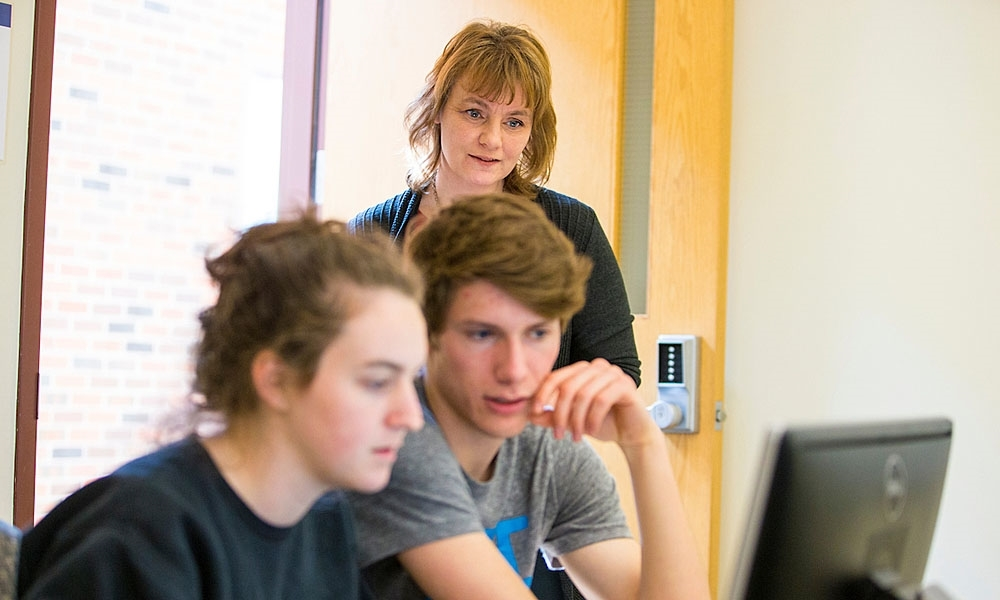

```{r setup, include=FALSE}
knitr::opts_chunk$set(echo = TRUE, fig.align = "center")
library(readxl)
library(mosaic)
theme_set(theme_bw())

relabel1 <- function(x) {
  factor(
    case_when(
      grepl("Never", x)       ~ "0. Never",
      grepl("dabbled", x)     ~ "1. Dabbled",
      grepl("use it some", x) ~ "2. Used Some",
      grepl("comfortable", x) ~ "3. Comfortable",
      grepl("expert", x) ~ "4. Local Expert"
    ),
    levels = c("0. Never", "1. Dabbled", "2. Used Some", 
               "3. Comfortable", "4. Local Expert")
  )
}

S <- read_excel("../../Logistics/JMM2019PreSurvey.xlsx") %>%
  mutate(
    start = grepl("#2", courses),
    keep = grepl("#12", courses),
    course = 
      case_when(
        start & keep ~ "both",
        start        ~ "start",
        keep         ~ "keep"),
    tidyverse.prof =
      case_when(
        grepl("Never", tidyverse)  ~ "0. None",
        grepl("confuses", tidyverse)  ~ "1. Little",
        grepl("not proficient", tidyverse)  ~ "2. Some",
        grepl("comfortable", tidyverse)  ~ "3. Comforatble"
      ),
    excel.prof       = relabel1(excel.proficiency),
    programming.prof = relabel1(programming.proficiency),
    maple.prof       = relabel1(maple.proficiency),
    R.prof           = relabel1(R.proficiency)
  )
                
         
```

```{r, include = FALSE}
df_stats(R.prof ~ course, data = S, counts)
gf_counts(~ R.prof | course ~ ., data = S, fill = ~ courses, show.legend = FALSE)
gf_counts(~ excel.prof | course ~ ., data = S, fill = ~ courses, show.legend = FALSE)
gf_counts(~ programming.prof | course ~ ., data = S, fill = ~ courses, show.legend = FALSE)
gf_counts(~ maple.prof | course ~ ., data = S, fill = ~ courses, show.legend = FALSE)
```

# Participants

## Hello, my name is ...

Take a moment to introduce yourself 

  * to **at least THREE** people,
  * who are sitting **near you**, but
  * whom you **do not already know**.
  
Things you might share about yourself:

  * name, institution, 
  * why you are in this minicourse 
  * favorite hobby 
  * something on the JMM program you are looking forward to

## When do we fill out surveys?

```{r, echo = FALSE}
d1 <- lubridate::mdy_hms("jan-09-2019 11:24:00am")
d2 <- lubridate::mdy_hms("jan-13-2019 01:02:00am")
gf_histogram( ~ time, data = S, boundary = min(S$time),
              binwidth = lubridate::hours(3)) %>% 
  gf_vline(xintercept = d1, color = "red", size = 1.5, alpha = 0.6) %>%
  gf_vline(xintercept = d2, color = "red", size = 1.5, alpha = 0.6) %>% 
  gf_labs(x = "survey submission time (EST)")
```

## When do we fill out surveys?

```{r, echo = FALSE}
d1 <- lubridate::mdy_hms("jan-09-2019 11:24:00am")
d2 <- lubridate::mdy_hms("jan-13-2019 01:02:00am")
gf_jitter(R.proficiency ~ time, data = S %>% filter(keep), 
          width = 0, height = 0.3,
          alpha = 0.7, size = 1.5) %>%
  gf_vline(xintercept = d1, color = "red", size = 1.5, alpha = 0.6) %>%
  gf_vline(xintercept = d2, color = "red", size = 1.5, alpha = 0.6) %>% 
  gf_labs(x = "survey submission time (EST)")
```


## How much have we used tidyverse?


```{r, echo = FALSE}
gf_counts(~ tidyverse.prof, data = S %>% filter(keep), 
          fill = ~ course, show.legend = TRUE) %>%
  gf_labs(x = "tidyverse proficiency")
```

# What is tidyverse?

## What is tidyverse?

* A collection of packages by Hadley Wickham (and friends)
  * goal: solve important data analysis problems in a coherent, systematic way

* `dplyr` and `tidyr`: parts of this toolkit devoted to data transformation

  * useful for preparing "found data" for your students
  * useful for combining data from multiple sources
  * useful for rearranging data to make it more convenient to work with
  
# Presenters/Facilitators

## Shonda Kuiper, Grinnel College

```{r, echo = FALSE, out.width = "80%", fig.align = "center"}

```

## Randall Pruim, Calvin College

```{r, echo = FALSE, out.width = "60%", fig.align = "center"}
knitr::include_graphics("../images/InchWormMedium.jpg")
```


